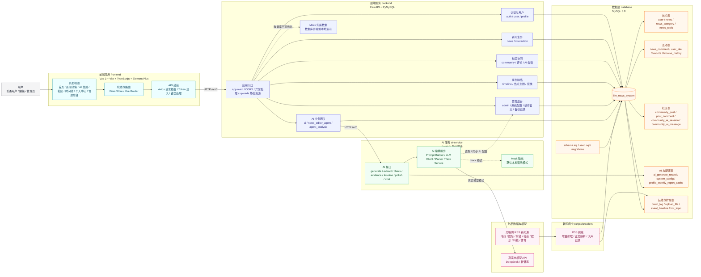

# 项目架构图

本文档给出“基于大语言模型的智能新闻摘要与协同互动系统”的项目架构图。图中按访问层、业务服务层、AI 能力层、数据层和外部数据源划分，适合放入项目报告、README 或答辩材料。

## 架构说明

1. 前端只调用后端 `backend` 的 `/api/*` 接口，不直接访问 `ai-service` 或数据库。
2. 后端负责统一认证、业务接口、数据库访问、文件上传资源和 AI 调用编排。
3. AI 能力独立部署为 `ai-service`，默认支持 mock 输出，也可以通过配置切换到真实大模型 API。
4. MySQL 是核心数据存储，承载用户、新闻、互动、社区、AI 生成记录、系统配置、爬虫日志和事件时间线等数据。
5. RSS 爬虫作为离线或定时任务运行，从光明网 RSS 源抓取新闻并写入 MySQL。
6. 后端检测数据库不可用时保留 mock fallback，便于本地演示和调试。

